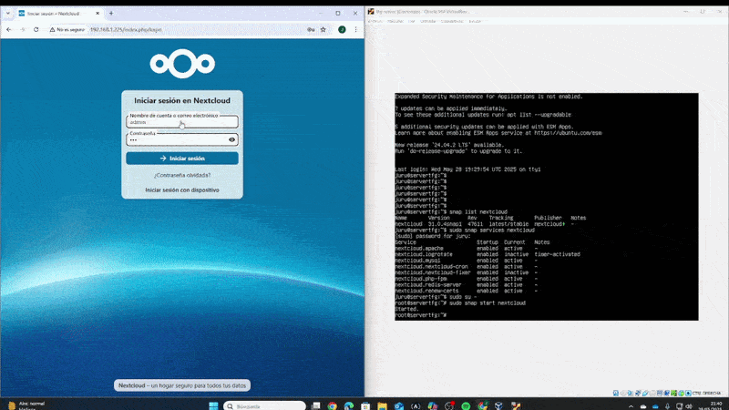
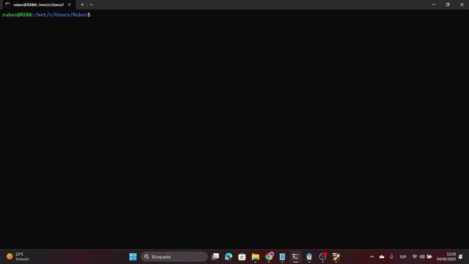
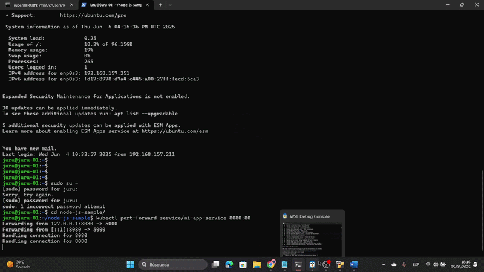

# 🌐 Nextcloud en Kubernetes — TFG ASIR

> Despliegue completo de Nextcloud sobre Ubuntu Server, con seguridad, acceso remoto por VPN y evolución hacia contenedores y Kubernetes.

---

## 📋 Tabla de Contenidos

1. [Visión general](#-visión-general)
2. [Objetivos](#-objetivos)
3. [Arquitectura](#-arquitectura)
4. [Red, seguridad y acceso remoto](#-red-seguridad-y-acceso-remoto)
5. [Docker y Kubernetes](#-docker-y-kubernetes)
6. [Proyectos 42 Madrid sobre Kubernetes](#-proyectos-42-madrid-sobre-kubernetes)
7. [Demostraciones](#-demostraciones)
8. [Documentación](#-documentación)
9. [Autor](#-autor)

---

## 🔭 Visión general

Este proyecto es el **Trabajo de Fin de Grado (TFG)** del ciclo formativo de Administración de Sistemas Informáticos en Red (ASIR). Su objetivo principal es desplegar **Nextcloud** —una plataforma de almacenamiento y colaboración en la nube— sobre **Ubuntu Server**, aplicando buenas prácticas de seguridad, automatización y alta disponibilidad.

El entorno evolucionó desde una instalación clásica en servidor bare-metal hasta un despliegue orquestado con **Kubernetes**, pasando por una fase intermedia basada en **Docker**. A lo largo del proceso se configuraron redes internas (VLAN), acceso remoto seguro mediante VPN, certificados TLS y múltiples zonas de trabajo con control de acceso basado en roles.

---

## 🎯 Objetivos

- Desplegar Nextcloud de forma segura y accesible desde Internet.
- Configurar un dominio personalizado con **TLS/SSL** (Let's Encrypt).
- Proteger el servidor con **firewall** (UFW) y acceso **SSH** restringido.
- Proporcionar acceso remoto universal mediante una **VPN privada** (Tailscale).
- Contenedorizar el entorno con **Docker** y orquestarlo con **Kubernetes**.
- Usar Kubernetes como plataforma para levantar instancias de **proyectos de 42 Madrid**.

---

## 🏗️ Arquitectura

El sistema se compone de dos servidores que forman una **VLAN interna** basada en contenedores:

```
Internet
   │
   ▼
[Dominio + Let's Encrypt TLS]
   │
   ▼
[Ubuntu Server — Nextcloud]
   ├── Firewall (UFW)
   ├── SSH restringido
   ├── VPN Tailscale (acceso remoto)
   └── VLAN interna
         ├── Servidor 1 (Nextcloud / servicios principales)
         └── Servidor 2 (workers / réplicas)
               ├── Docker → Kubernetes (Minikube / clúster real)
               └── Pods: almacenamiento, compilación, métricas
```

El administrador puede levantar instancias independientes para visualizar métricas de los contenedores y del sistema, así como gestionar los sistemas de ficheros compartidos por los distintos usuarios y sus roles.

---

## 🔒 Red, seguridad y acceso remoto

| Componente | Descripción |
|---|---|
| **Ubuntu Server** | Sistema operativo base del servidor |
| **UFW (Firewall)** | Reglas de entrada/salida para minimizar la superficie de ataque |
| **SSH** | Acceso remoto seguro al servidor, con autenticación por clave |
| **Dominio personalizado** | DNS apuntando al servidor público |
| **Let's Encrypt / TLS** | Certificado SSL gratuito y renovación automática (Certbot) |
| **Tailscale VPN** | Red privada cifrada para acceso remoto desde cualquier lugar del mundo |

La VPN privada fue una pieza clave del proyecto: permite conectarse al entorno interno de forma segura sin exponer puertos adicionales en el servidor.

---

## 🐳 Docker y Kubernetes

El proyecto siguió una evolución natural hacia la contenedorización:

1. **Fase 1 — Servidor tradicional**: Nextcloud instalado directamente sobre Ubuntu Server.
2. **Fase 2 — Docker**: Los servicios se encapsulan en contenedores para facilitar la portabilidad y el aislamiento.
3. **Fase 3 — Kubernetes**: Orquestación de los contenedores para alcanzar **alta disponibilidad**, escalado horizontal y gestión declarativa.

Se evaluaron tanto **Minikube** (entorno local de desarrollo) como un **clúster real** multi-nodo, permitiendo comparar ambos enfoques en términos de rendimiento y operabilidad.

Los pods se diseñaron para:
- Ejecutar y compilar código de los usuarios.
- Alojar servicios de almacenamiento compartido con control de acceso por roles.
- Exponer métricas del sistema para monitorización por parte del administrador.

---

## 🎓 Proyectos 42 Madrid sobre Kubernetes

Kubernetes se usó además como plataforma para levantar instancias de **proyectos del cursus de 42 Madrid**, permitiendo:

- Aislar cada proyecto en su propio pod/namespace.
- Compilar y ejecutar código C/C++ en entornos reproducibles.
- Gestionar recursos de forma eficiente entre múltiples usuarios simultáneos.
- Facilitar la entrega y evaluación de proyectos en un entorno estandarizado.

Esta integración demuestra la versatilidad de Kubernetes más allá del hosting web, convirtiéndolo en una plataforma educativa y de desarrollo.

---

## 🎬 Demostraciones

### Parte 1 — Configuración y despliegue inicial



---

### Parte 2 — Despliegue y contenedorización



---

### Parte 3 — Funcionamiento final



---

## 📄 Documentación

Los siguientes documentos PDF recogen la memoria completa del proyecto:

| Documento | Descripción |
|---|---|
| [📘 Memoria del Proyecto Final (Tailscale v2)](./Memoria_Proyecto_Final_Extendida_Tailscale_v2.pdf) | Memoria extendida con la configuración de Tailscale VPN y el despliegue completo |
| [📗 Proyecto Servidor en la Nube — Mix Docker](./PROYECTO_SERVIDOR_EN_LA_NUBE_MIX_DOCKER.pdf) | Documentación de la fase Docker y la arquitectura en la nube |

---

## 👤 Autor

Proyecto desarrollado como **TFG del ciclo ASIR** en el contexto de la formación técnica y la escuela **42 Madrid**.

- 🐙 GitHub: [@cyberlock18](https://github.com/cyberlock18)

---

> *"De un servidor Ubuntu a un clúster Kubernetes — el camino completo."*
